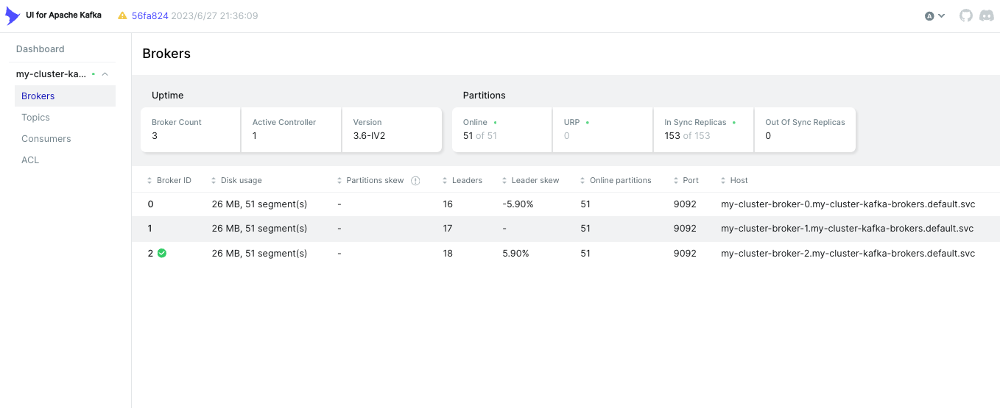
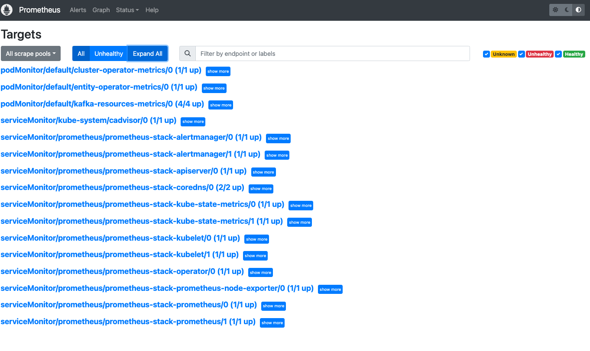
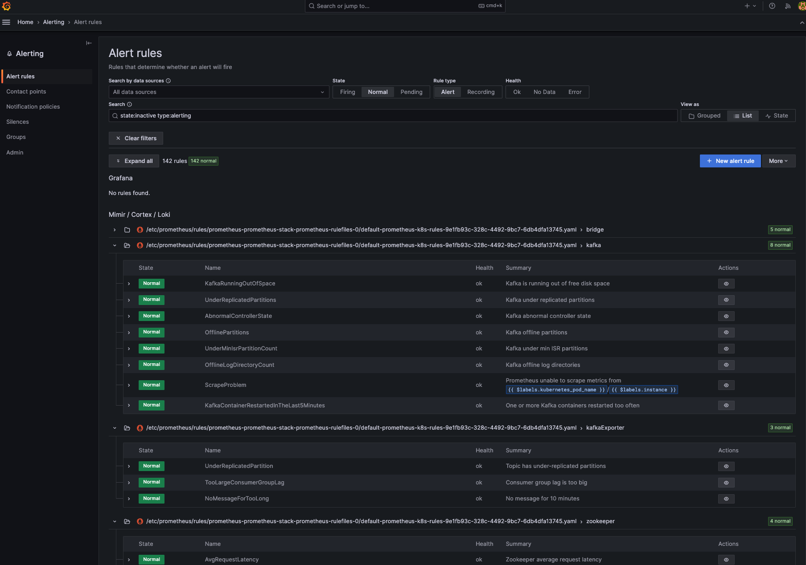
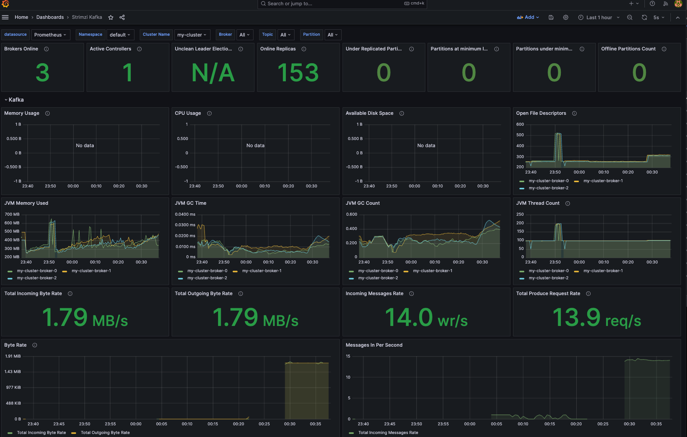
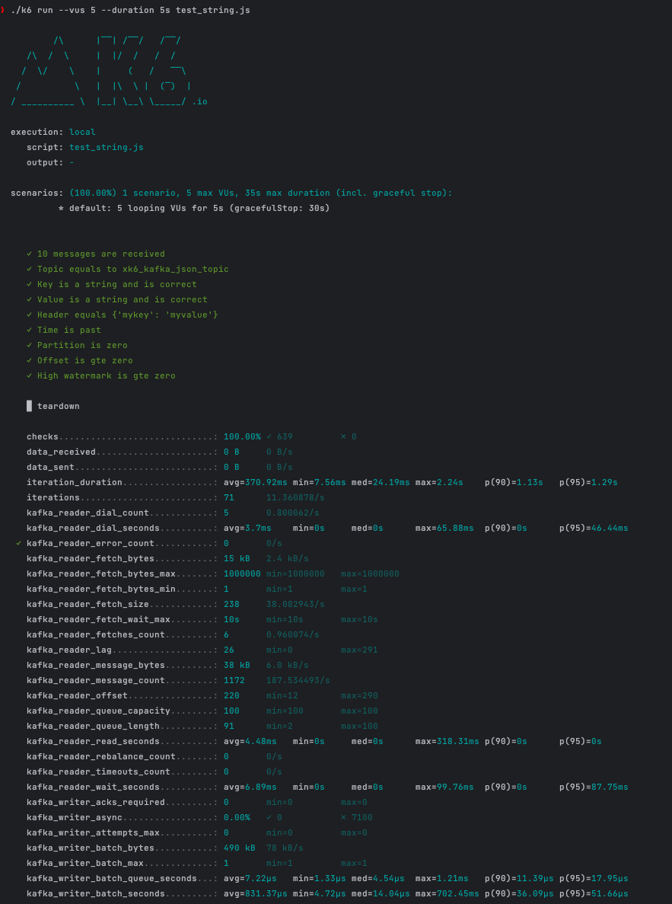

Kafka Demo
---

Provision a Kafka cluster without Zookeeper ensemble and production ready related stack on Kubernetes.

## Kafka (Kraft mode)

 - version: 3.6.0
 - operator: strimzi-kafka-operator(0.38.0)

## Kafka UI

## Prometheus & Grafana
 - monitoring: 
 - alerting: 
 - dashboard: 

## K6 (Testing)

## Vector (Consumer)
 - version: 0.34.1

## KEDA (Auto-scaling)
 - version: 2.12.0

